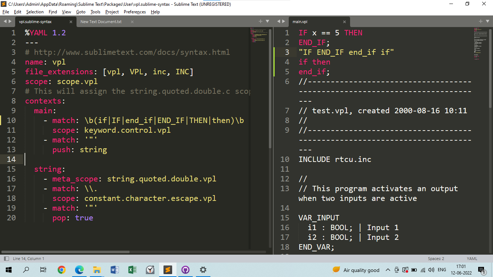

# VPL-Syntax-Highligter

## Intro

 - VPL is a propietary language devolped by LogicIO to program RTCU Gateways. 
 - Since the RTCU IDE did not have a nice syntax highlighting for the VPL, we 
have decided to devolp this. 

 - Check out their gateways https://logicio.com/rtcu_products.htm

 - RTCU IDE https://logicio.com/HTML/#:~:text=RTCU%20IDE&text=The%20RTCU%20IDE%20(Integrated%20Development,very%20advanced%20M2M%2FIoT%20applications.

## Try it out 

	1) Install Sublime Text Editor
	2) Select Tools -> Devolper -> New Syntax
	3) Save the file as "vpl.sublime-syntax"
	4) It will be in the Installation Location of the Sublime (C:\Users\Admin\AppData\Roaming\Sublime Text) 
	5) This is a YAML File so we have to edit that out. Copy the contents from our repo located under Sublime folder and paste in yours 
	6) To check out just create a simple file "main.vpl" and then see the color magic happen ✨  
	7) See the example screen shot below 😎
	

	
## Early Tries

### VSCode

 - After we stumbled on this video of making a custom syntax highlighter in VSCode
 - https://www.youtube.com/watch?v=5msZv-nKebI
 - I decided to try out this but easily failed and decided to try in other editors like Atom, Sublime
 
### Atom text editor
 
 - Then I tried in the Atom text editor, but got to know that Atom Text editor has been discontinued by Github
 - So check out this website he actually describes it nice about how to do it in Atom Text Editor
 - https://www.sitepoint.com/how-to-write-a-syntax-highlighting-package-for-atom/
 
### Sublime 
 - So since VScode is our goal, I thought the knowledge that I gain from devolping in Sublime is going to apply there as well
 - Official Doc https://www.sublimetext.com/docs/syntax.html 
 
