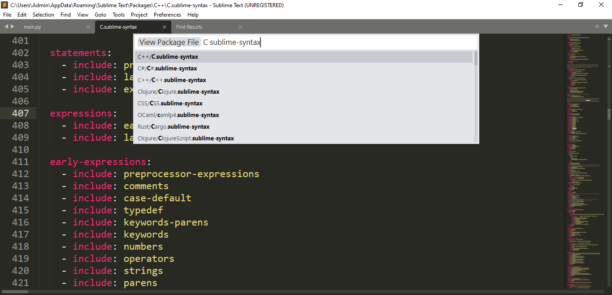

# Reg Ex Notes 

# FAQS

## How to Make a Reg Ex that can match case insenstive word
	Check out the question here
	https://superuser.com/questions/903168/how-should-i-write-a-regex-to-match-a-specific-word
	Well after seeing this I used \b((?i)break(?-i))\b 
	which matches for both "break" and "BREAK"
	
## How to Open the C Syntax Highlighter
	go to tools -> Devolper -> View Package File
	Then a command window opens
	Start to type "C sublime-syntax"
	Open the first result

	